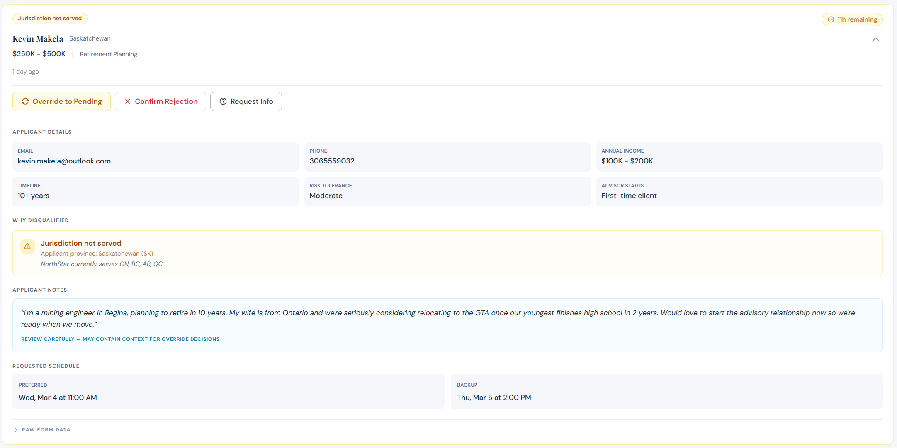
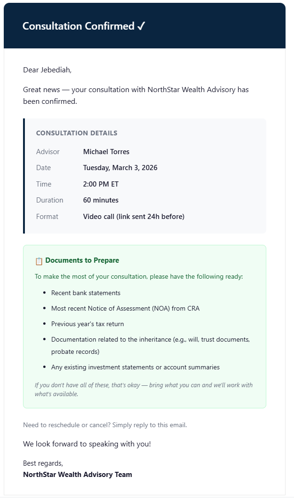
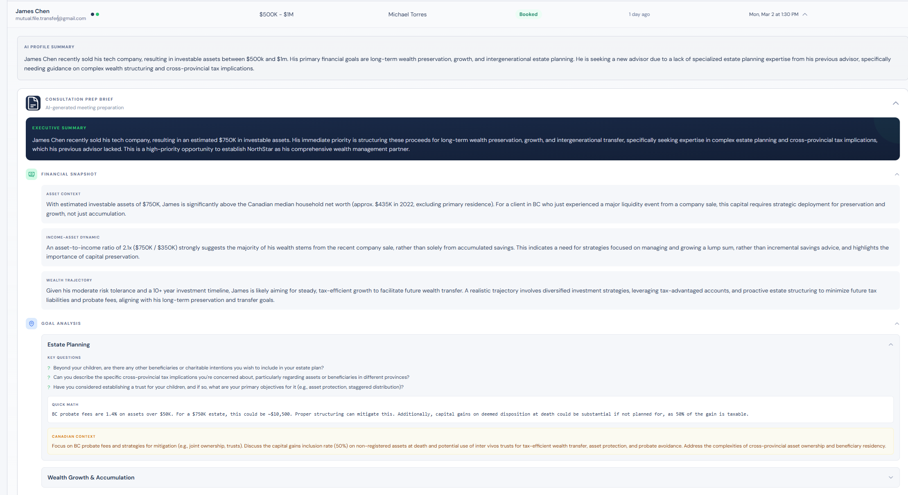
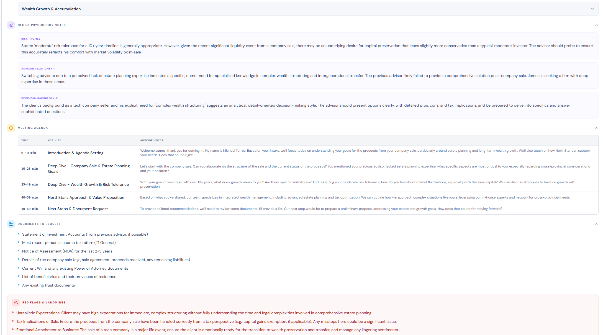
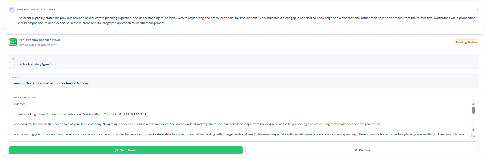
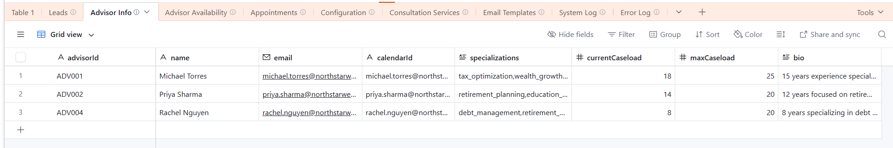

# NorthStar Wealth Advisory — AI-Powered Lead Pipeline

An end-to-end AI-powered lead qualification, enrichment, and advisor matching pipeline for a financial advisory firm. Built for the Wealthsimple AI Builder application.

---

## Demo Video

https://smuharsky.wistia.com/medias/y48jm2ptpk

*Apologies — the demo runs longer than the requested 2–3 minutes. I'd recommend watching at 1.25x playback speed.*

---

## Written Explanation

**What the human can now do that they couldn't before:**

An advisor can now qualify, prepare for, and book a client consultation in under three minutes — a process that used to take thirty to forty. They review an AI-generated profile summary grounded in the firm's compliance policy manual, scan risk flags and advisor match rankings, and approve or reject with confidence.

But the bigger shift isn't speed — it's depth. Advisors walk in with a full prep brief: financial snapshot, goal-by-goal analysis with Canadian-specific context like RRSP room and TFSA limits, client psychology notes, a time-blocked meeting agenda, and red flags to watch for. They can have a better first meeting with a client they've never spoken to than most advisors have after three. One person can now handle ten times the volume without sacrificing the quality of attention each client gets.

**What AI is responsible for:**

AI handles the cognitive grunt work: lead enrichment, consultation prep brief generation, and pre-meeting nurture email drafting. All enrichment is RAG-powered — the AI queries embedded firm policy documents so outputs reflect actual firm policies, not generic financial advice. A separate compliance guardrails agent reviews every drafted email against those same policies before it reaches the advisor.

**Where AI must stop:**

The system uses three layers of decision-making:

Deterministic code answers the binary questions — does this applicant meet the asset minimum, can we service their tax jurisdiction — because if-statements don't hallucinate and are predictable.

The advisor then uses their professional judgment, enhanced by AI-generated intelligence, to make the final call — a decision that carries fiduciary weight and requires an audit trail that AI can't provide. Maybe the AI overlooked something. Maybe there's a human factor that changes everything.

AI handles the creative, analytical work: synthesizing client profiles, generating conversation starters, drafting personalized emails. But no AI-generated message is auto-sent. When you're dealing with hundreds of thousands or millions of dollars, you can't leave client communications to chance. The advisor reviews, edits if needed, and sends.

**What would break first at scale:**

The system would certainly need to be adapted for a production launch. Currently, every lead triggers a RAG query against the firm's policy documents plus structured output generation from Gemini — that's the most compute-intensive step in the system, and it processes sequentially today. At tens of concurrent submissions, latency climbs. At hundreds, you'd need a proper job queue, parallel workers, and dedicated inference endpoints rather than shared API quotas. The architectural answer is batching and prioritization: triage leads by likely fit before spending the compute on full enrichment, so you're not burning inference cycles on leads that deterministic rules would have caught. Frankly, the optimization at scale is often less AI and more code — the same principle that drives the rest of the system.

---

## Salary Expectation & AI Experience

**Salary expectation:** $140,000

**Hands-on AI experience:** 1 year building comprehensive, end-to-end agentic workflows featuring multi-agent AI orchestration across deeply branched, complex conversational flows.

---

# System Documentation

---

## What The System Does

### Automated Intake & Qualification
A prospective client fills out a multi-step intake form. The system immediately validates the submission and applies deterministic disqualification rules — jurisdiction, minimum asset threshold, and goal fit. No AI involved here: rule-based filtering eliminates false negatives from hallucination. Disqualified leads get a 48-hour grace period before any rejection email is sent, giving the advisor time to override edge cases the rules can't catch.

### Flagged Leads — Human Override for Rule-Based Rejections
Disqualified leads aren't silently discarded. They appear in a dedicated **Flagged** tab in the admin dashboard, where the advisor sees a rich detail card for each one:

- **DQ reason badges** with contextual explanations — which rule triggered, what the firm policy is, and the specific values that failed (e.g., "Province: SK — firm serves ON, BC, AB, QC only")
- **Grace period countdown** showing time remaining before the automated rejection email fires
- **Full applicant details** including scheduling preferences, free-text notes, and financial profile
- **Three actions**: Override to Pending (sends lead through enrichment), Confirm Rejection (immediately triggers WF8, skipping the 48h wait), or Request Info (asks a follow-up question)

This matters because rules are blunt instruments. A client who selected "Saskatchewan" but wrote "relocating to Ontario next month" in their free text would be auto-disqualified by jurisdiction rules — but any human reading the full context would override that. The Flagged view ensures the advisor always gets that chance before a rejection email goes out.



### RAG-Powered Lead Enrichment
Leads that pass disqualification enter the AI enrichment pipeline (Gemini 2.5 Flash). This is where the system's intelligence lives:

- **Priority Scoring** — AI classifies each lead as HIGH / MEDIUM / LOW priority with reasoning, weighing asset level, goal complexity, timeline urgency, and switching signals
- **Profile Summary** — A concise 2-4 sentence narrative synthesizing the client's financial situation, goals, and context for quick advisor comprehension
- **Risk Flag Detection** — Identifies regulatory, suitability, and relationship risks with severity levels (HIGH/MEDIUM/LOW) and specific detail. Examples: "Client mentions crypto holdings — ensure KYC compliance," "Switching from existing advisor — probe for unresolved issues"
- **Advisor Match Ranking** — Scores and ranks all advisors against the lead based on specialization fit, caseload capacity, and contextual relevance. Each match includes a reasoning narrative
- **Conversation Starters** — AI-generated talking points tailored to the client's specific situation, giving advisors a warm opening
- **Service Tier Recommendation** — Maps the client to the appropriate service tier (Financial Planning / Wealth Management / Executive Wealth) with reasoning

All enrichment is grounded in firm context through a RAG pipeline (WF13) that ingests the firm's compliance policy manual and configuration data, ensuring AI outputs reflect actual firm policies, service offerings, and regulatory requirements rather than generic financial advice.

### Intelligent Advisor Matching & Scheduling
When the admin approves a lead and selects an advisor, the system cross-checks availability in real-time:

- If the selected advisor matches the one whose availability was pre-verified AND a time slot is open — **instant booking**. The system creates the appointment and confirms with the client immediately.
- If the admin picks a different advisor, or the verified advisor's slot is no longer available — **automated email outreach** begins. The system sends the client a professionally crafted email with alternative time options and monitors for replies.
- **Inbound email processing** (WF6) uses AI to parse client responses — detecting intent (accept a slot, request different time, ask a question, cancel) and acting accordingly without human intervention.
- **Follow-up cadence** runs automatically: reminders at 48 hours and 96 hours, then marks the lead as unresponsive after 7 days.



### AI-Generated Consultation Prep Brief
Once a meeting is booked, the system generates a comprehensive prep brief for the advisor containing:

- **Executive Summary** — Key facts and strategic context in a quick-scan format
- **Financial Snapshot** — Asset context, income-asset dynamics, wealth trajectory analysis
- **Goal-by-Goal Analysis** — Each financial goal broken down with key questions to ask, quick math (e.g., RRSP contribution room estimates), and Canadian-specific regulatory context (TFSA limits, RESP grants, etc.)
- **Client Psychology Notes** — Risk profile interpretation, advisor relationship dynamics, decision-making style inferences
- **60-Minute Meeting Agenda** — Time-blocked agenda with advisor notes per segment
- **Documents to Request** — Checklist of what the client should bring
- **Red Flags & Landmines** — Topics to approach carefully or avoid
- **Competitive Intelligence** — Only shown when the client is switching from another advisor; insights on what to probe

This brief is displayed in the dashboard as a rich, collapsible interface — not a wall of text.





### Pre-Meeting Nurture Email with Guardrails
The system drafts a personalized pre-meeting nurture email for the advisor to send to the client before their consultation. Key design choices:

- **Editable** — The advisor sees the full draft in a textarea and can modify it before sending
- **Guardrails** — The AI generation pipeline includes compliance constraints from the RAG-ingested policy manual, ensuring the email doesn't make promises, reference specific returns, or violate firm communication standards
- **Send via backend** — The email is sent through the n8n workflow (WF12) via Gmail, not through a mailto: link. This avoids browser URL length limits, maintains audit trails, and updates the lead's status in Airtable automatically
- **Dismiss option** — If the advisor doesn't want to send a nurture email, they can dismiss it



---

## Architecture

```
CLIENT INTAKE FORM (React)          ADMIN DASHBOARD (React)
     localhost:5173                      localhost:5174
          |                                   |
          | POST                     Airtable | REST reads
          v                                   | n8n webhook writes
   +-----------+                              v
   |   n8n     |  13 automated workflows  +-----------+
   | localhost  |<----------------------->|  Airtable  |
   |   :5678   |                          |  (10 tables)|
   +-----------+                          +-----------+
        |
        +---> Gmail API (outreach, nurture, rejection emails)
        +---> Google Gemini 2.5 Flash (enrichment, email parsing, content generation)
        +---> Redis (state cache, processing locks, business data)
```

---

## n8n Workflows (13 total)

| # | Workflow | What It Does |
|---|---------|-------------|
| WF1 | Intake & Auto-Disqualification | Validates submission, applies disqualification rules, writes to Airtable (no rejection email — 48h grace period) |
| WF2 | AI Enrichment Pipeline | Gemini generates: profile summary, priority score, risk flags, advisor ranking, conversation starters, service tier |
| WF3 | Availability Pre-Check | Checks if top-ranked advisor has the client's preferred/backup time slots open |
| WF4 | Dashboard Action Endpoints | 6 webhooks handling approve/reject/override/request-info/list-disqualified/confirm-reject from admin dashboard |
| WF5 | Email Outreach & Booking | Sends confirmation or outreach email, creates appointment, triggers WF10+WF11 |
| WF6 | Inbound Email Processing | AI parses client email replies — books, cancels, answers questions, or escalates |
| WF7 | Follow-Up Cadence | Automated reminders at 48h and 96h; marks unresponsive at 7 days; sends disqualification rejection emails after 48h grace period expires |
| WF8 | Rejection Email Generation | Deterministic rejection email templates — no AI. Code node selects template + resources based on rejection reason and client's stated goals. Ensures consistency, auditability, and zero hallucination risk for client-facing rejection communications. |
| WF9 | Business Data Cache Refresh | Syncs Airtable config, advisors, services, and templates to Redis cache |
| WF10 | Consultation Prep Brief Generator | AI generates comprehensive meeting prep (executive summary, agenda, goal analysis, psychology notes, red flags) |
| WF11 | Pre-Meeting Nurture Email Drafts | AI drafts pre-meeting email with compliance guardrails from RAG context |
| WF12 | Nurture Email Send | Sends approved/edited nurture email via Gmail, updates Airtable status |
| WF13 | Compliance Document Ingestion (RAG) | Ingests firm policy documents into vector embeddings for retrieval during AI generation |

---

## Lead Lifecycle

```
Form Submitted
      |
      v
  Disqualification Rules -----> DISQUALIFIED (48h grace period)
      |                               |
      |                               +---> Admin overrides --> PENDING_ENRICHMENT
      |                               +---> Admin confirms reject --> REJECTED (WF8 immediately)
      |                               +---> Admin requests info --> AWAITING_INFO
      |                               +---> Grace expires (WF7) --> REJECTED (WF8 auto-sends)
      |
      v (passed)
  AI Enrichment (Gemini + RAG)
      |
      v
  PENDING_REVIEW  <-- admin sees this in "Pending Review" tab
      |
      +---> APPROVED ---> Availability Check
      |                      |
      |                      +---> Slot available --> BOOKED --> Prep Brief + Nurture Email
      |                      |
      |                      +---> Conflict --> OUTREACH_IN_PROGRESS --> AI email parsing
      |                                              |
      |                                              +---> BOOKED
      |                                              +---> UNRESPONSIVE (after 7 days)
      |                                              +---> CANCELLED_BY_LEAD
      |
      +---> REJECTED (AI-generated rejection email sent)
      |
      +---> AWAITING_INFO (follow-up question sent to client)
```

---

## Repository Structure

```
.
├── client-intake-form/              # 5-step client intake web form
│   ├── src/
│   │   ├── pages/
│   │   │   ├── IntakeForm.jsx           # Multi-step form with validation
│   │   │   └── ThankYou.jsx
│   │   └── components/
│   │       ├── PersonalInfo.jsx         # Step 1: Name, email, phone, province
│   │       ├── FinancialProfile.jsx     # Step 2: Assets, income, goals
│   │       ├── InvestmentPreferences.jsx# Step 3: Timeline, risk, advisor status
│   │       ├── ConsultationScheduling.jsx# Step 4: Date/time pickers
│   │       └── AdditionalContext.jsx    # Step 5: Notes + consent
│   └── .env.example
│
├── admin-dashboard/                 # Lead management dashboard
│   ├── src/
│   │   ├── pages/
│   │   │   ├── PendingReview.jsx        # New leads awaiting decision
│   │   │   ├── Flagged.jsx              # Disqualified leads with override/confirm/request-info
│   │   │   └── ActivePipeline.jsx       # Approved / booked / completed leads
│   │   ├── components/
│   │   │   ├── LeadCard.jsx             # Expandable card with all AI enrichment data
│   │   │   ├── DisqualifiedCard.jsx     # Rich detail card for flagged leads (DQ reasons, grace countdown)
│   │   │   ├── ApproveModal.jsx         # Advisor selection + dynamic availability check
│   │   │   ├── RejectModal.jsx          # Rejection reason + notes
│   │   │   ├── ConfirmRejectModal.jsx   # Confirm rejection (skip grace period, trigger WF8)
│   │   │   ├── RequestInfoModal.jsx     # Follow-up question to client
│   │   │   ├── ConsultationPrepBrief.jsx# Rich collapsible prep brief (8 sections)
│   │   │   └── NurtureEmailCard.jsx     # Editable email draft + send/dismiss
│   │   ├── hooks/
│   │   │   ├── useLeads.js              # Airtable fetch with normalization
│   │   │   └── useAdvisors.js           # Advisor list for assignment
│   │   └── utils/
│   │       ├── airtable.js              # Airtable REST client
│   │       ├── api.js                   # Reads from Airtable, writes to n8n
│   │       └── formatters.js            # Date/currency/text helpers
│   └── .env.example
│
├── WF1 through WF13 (*.json)       # 13 n8n workflow exports (importable)
├── NorthStar_Comprehensive_Policy_Manual.pdf
└── NorthStar_Wealth_Advisory_Pipeline.xlsx  # Airtable import template
```

---

## Tech Stack

| Layer | Technology |
|-------|-----------|
| Frontend | React 18, Vite 6, Tailwind CSS, React Router |
| Typography | Playfair Display (headings), DM Sans (body) |
| Backend Orchestration | n8n (13 workflows, 200+ nodes) |
| AI | Google Gemini 2.5 Flash (enrichment, parsing, generation) |
| RAG | Vector embeddings from compliance docs (WF13) fed into enrichment and generation prompts |
| Database | Airtable (10 tables, 42+ fields on Leads) |
| Cache | Redis (state management, business data, processing locks) |
| Email | Gmail API |

---

## Data Model (Airtable — 10 Tables)

| Table | Fields | Purpose |
|-------|--------|---------|
| Leads | 42 | Full pipeline: intake + AI enrichment + booking + follow-up state |
| Advisor Info | 8 | Profiles: specializations, caseload capacity |
| Advisor Availability | 5 | Daily time slots per advisor |
| Appointments | 10 | Booked consultations |
| Configuration | 2 | Key-value firm settings (20 records) |
| Consultation Services | 5 | Service tiers with asset ranges |
| Email Templates | 3 | Outbound email templates (7 types) |
| System Log | 4 | Audit trail |
| Error Log | 5 | Workflow error tracking |



---

## Running Locally

### Prerequisites
- Node.js 18+
- n8n instance (self-hosted or cloud)
- Airtable account with base imported from `NorthStar_Wealth_Advisory_Pipeline.xlsx`
- Redis instance
- Google Cloud project with Gmail API enabled
- Google Gemini API key

### Client Intake Form
```bash
cd client-intake-form
cp .env.example .env        # Edit with your webhook URL
npm install
npm run dev                 # http://localhost:5173
```

### Admin Dashboard
```bash
cd admin-dashboard
cp .env.example .env        # Edit with your Airtable PAT + base ID
npm install
npm run dev                 # http://localhost:5174
```

### n8n Workflows
1. Import all 13 WF JSON files into your n8n instance
2. Configure credentials: Airtable PAT, Redis, Gmail, Gemini API key
3. Activate workflows in order: WF9 first (cache refresh), then WF1-WF8, then WF10-WF13

**MASTER_WS_AI_BUILDER_WF.json** — A consolidated visual reference containing all 13 workflows in a single canvas. Not meant to be executed — import it to see the full system architecture at a glance.

---

## Key Design Decisions

**Reads from Airtable, writes through n8n.** The dashboard reads leads/advisors directly from Airtable's REST API for speed. All mutations go through n8n webhooks so downstream workflows trigger automatically.

**Deterministic rules + AI enrichment.** Disqualification is rule-based — no false negatives from hallucination. Enrichment uses AI where nuance matters.

**Grace period with human override.** Rule-based disqualification is immediate but rejection emails are delayed 48 hours. The Flagged tab gives the advisor full context — including free-text notes that might contradict the rule — and three action paths: override, confirm rejection, or request more information. This is where the system's human-in-the-loop design matters most: automated rules handle the common case, but edge cases get human judgment before any client-facing action.

**RAG-grounded generation.** The consultation prep brief and nurture email are generated with firm-specific context retrieved from the compliance policy manual (vectorized in WF13). This prevents generic financial advice and ensures outputs reflect actual firm policies.

**Human-in-the-loop at every AI output.** The admin decides on lead approval. The advisor reviews and edits the nurture email before sending. The prep brief is presented as decision support, not a directive. AI enhances the human — it doesn't replace judgment.

**Automated conflict resolution.** When a preferred time slot isn't available, the system doesn't just flag it — it automatically initiates email outreach with alternative options, processes the client's reply with AI intent parsing, and books the meeting once agreement is reached.

**Deterministic rejection emails.** Rejection emails use Code-node templates, not AI generation. Rejected prospects are potential future clients — a tone-deaf or hallucinated AI email is a
permanent brand and compliance risk. The same deterministic principle that governs disqualification rules also governs rejection communication: when the stakes are high and the output space is bounded, use code, not AI.

---

*Built by Stephen Muharsky for the Wealthsimple AI Builder role.*
